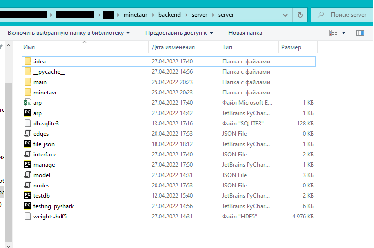
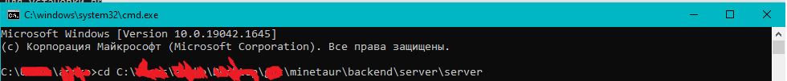

<h1>Добро пожаловать в Mine'тавр!</h1>

__Mine'тавр__[^1] - это Web-приложение по выявлению инцидентов несанкционированного использования вычислительных мощностей c помощью нейронной сети при анализе ключевых элементов инфраструктуры распределенных компьютерных сетей.
Система «Mine'тавр» рекомендована к использованию в случаях, при проверке компьютерных сетей и их элементов на предмет использования вычислительных мощностей для добычи криптовалюты.
Нейронная сеть позволяет на основе атрибутов, полученных из трафика, оценить риск несанкционированного использования вычислительных мощностей компьютерных сетей и с высокой точностью обнаружить заражённое устройство!
_____
Для установки программы необходимо:
1. Скачать Python 3.10
2. Установить Wireshark 3.6.3
3. Скачать библиотеки:
    3.1. Для этого в командной строке перейти в директорию, где находится файл requirements.txt (там же где и файл README.md)
    3.2. Написать следующую команду:
    ```
    pip install -r requirements.txt
    ```

4. После установки для запуска программы требуется:
    4.1. Открыть директорию с \backend\server\server
    
    4.2. Скопировать данную директорию, открыть командную строку и ввести:
    ```
    cd <Ваша директория>
    ```
    
    4.3. Перейдя в директорию вводим команду для запуска сервера:
    ```
    py manage.py runserver
    ```
    
    4.4. Далее необходимо зайти в браузер и ввести http://127.0.0.1:8000/
    
____
Для начала использования приложения нажмите кнопку "Построить карту сети"!


<h2>Приятной работы!</h2> 


[^1]: Данный продукт разработан молодой и успешной командой разработчиков Gecko